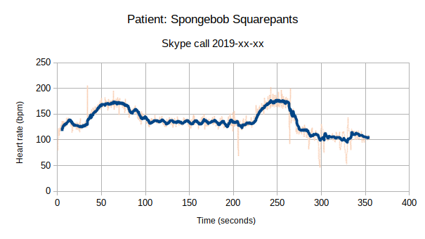

# Heartbeat graph template
Template to create a heart rate graph by clicking a button in sync with the beats

# Requirements

* LibreOffice
* A Python interpreter installed, not sure if LibreOffice for Windows already comes with one

# How to use

* Open the heartbeat-graph-template.ods with LibreOffice and give permission to execute macros.
* Click the Start button and then click the Beat button for each heart beat
* When you are happy with the result, you can copy and paste the image directly or save it as a PNG file by right clicking it and selecting Export as image.

# Example result

